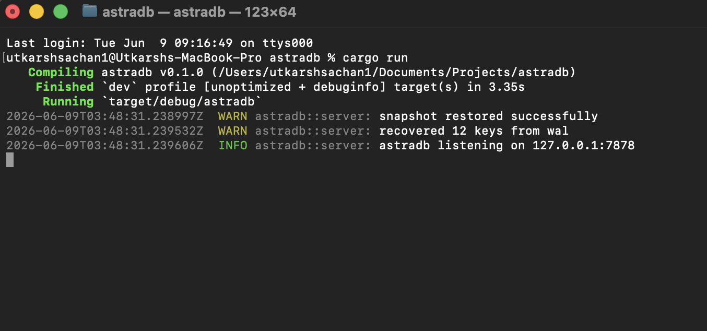

# AstraDB



AstraDB is a high-performance asynchronous key-value database built in Rust with a focus on concurrency, durability, and systems-level architecture.

The project explores the internal design of modern storage systems including write-ahead logging, snapshot persistence, background compaction, pipelined networking, TTL expiration, telemetry, and replication-ready event streaming.

---

## Architecture Overview

AstraDB is structured around several independent subsystems:

* Async TCP networking layer
* Sharded concurrent in-memory engine
* Write-ahead logging (WAL)
* Snapshot persistence
* Background compaction workers
* TTL expiration engine
* Metrics and observability layer
* Replication event bus
* Internal benchmarking harness

The goal of the project is to simulate many of the architectural patterns commonly used in modern infrastructure systems and distributed databases.

---

## Core Features

### Concurrent Storage Engine

The storage engine uses a sharded architecture powered by DashMap to reduce lock contention and improve concurrent write performance.

### Write-Ahead Logging

All mutations are persisted through a WAL before being applied to memory, allowing crash recovery after restart.

### Snapshot Persistence

Periodic snapshots are generated asynchronously in the background to reduce recovery overhead and bound WAL growth.

### WAL Compaction

After snapshot persistence, WAL compaction removes stale operation history and keeps recovery time predictable.

### TTL Expiration

Keys can be configured with expiration times using `SETEX`, enabling cache-style workloads and automatic cleanup.

### Pipelined Networking

The networking layer supports batched command processing and buffered responses to reduce syscall overhead.

### Metrics & Telemetry

Runtime metrics expose connection counts, command throughput, read/write statistics, and operational visibility.

### Replication Event Stream

All mutations are published through an internal event bus, enabling future replication and distributed synchronization support.

### Graceful Shutdown

The server supports coordinated shutdown with final snapshot persistence and background worker cleanup.

---

## Example Commands

```text
PING

SET framework rust

GET framework

DEL framework

SETEX session active 10

METRICS
```

---

## Running Locally

### Start Database

```bash
cargo run
```

### Run Benchmark

```bash
cargo run -- benchmark
```

### Connect via Netcat

```bash
nc 127.0.0.1 7878
```

---

## Docker Deployment

Build container:

```bash
docker build -t astradb .
```

Run container:

```bash
docker run -p 7878:7878 astradb
```

---

## Benchmarking

AstraDB includes a lightweight benchmarking harness for measuring throughput and stress-testing write performance.

Example benchmark execution:

```bash
cargo run -- benchmark
```

---

## Storage Layout

```text
data/
├── operations.log
└── snapshot.json
```

---

## Tech Stack

* Rust
* Tokio
* DashMap
* Serde
* Tracing
* Async TCP Networking

---

## Future Improvements

* Distributed replication
* Cluster coordination
* Binary protocol support
* Advanced compaction strategies
* Persistent storage engine
* Raft-based consensus
* Zero-copy parsing

---

## License

MIT
